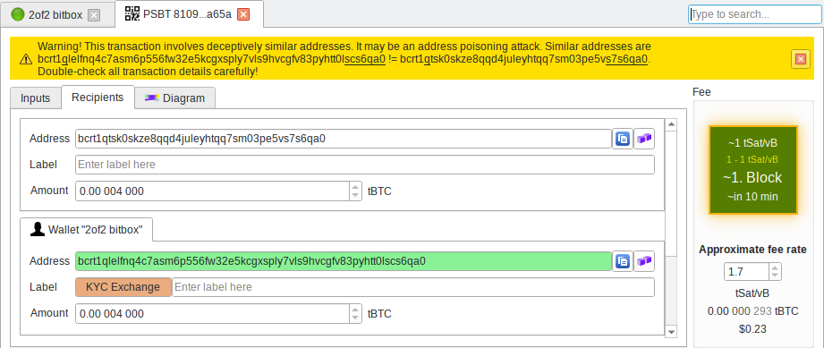

---
aliases:
  - "/features/address-poisoning/"
title: "Address Poisoning detection"
description: "Attackers can send you transactions with  addresses similar to yours. Bitcoin Safe will warn you if that happens"
draft: false
tags: [ "Features" ]
images: ["logo.png"]
keywords: ["address poisoning", "phishing", "dust attack", "wallet protection"]
---

###  
 

 

{ .img-fluid .mb-5 }

