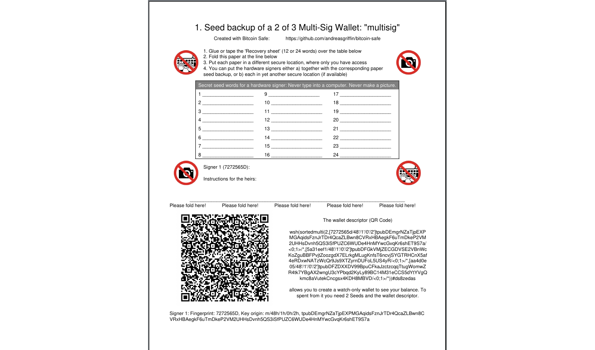
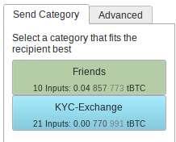

##  
<!--   -->

 
<!--   -->

### ✔ تخزين بتكوين آمن وبسيط
<!-- - ❌ 2-of-3 Multisignature is complex to use in other wallets -->
<!-- - 2-of-3 Multi-signature is a good choice  
    - Robust against loss or leak of 1 seed  -->
- يجعل معالج الإعداد  <a  href= role="button">معالج الإعداد</a> التوقيع الفردي والمتعدد سهلة للمستخدمين غير التقنيين
    --> ما عليك سوى اتباع كل خطوة لإعداد محفظة آمنة.   
    
    - يساعد <a  href=   role="button">   تصدير PDF</a> في عمل نسخ احتياطية لمواصفات المحفظة المهمة مع كل مفتاح استرداد.
    - سجّل المحفظة متعددة التوقيع مع كل جهاز توقيع مادي
    - يتضمن اختبار الاستلام والإنفاق من المحفظة للتأكد من عمل جميع أجهزة التوقيع الرئيسية
 

 

#### ✔ مزامنة وتسbackup للعلامات

سيقوم  بشكل سحري (من خلال قوة رسائل <a href="https://nostr.com/ ">nostr</a> المشفّرة)
- <a  href="" role="button">مزامنة</a> فئات العملات والملصقات عبر الحواسيب
- عمل نسخ احتياطية لفئات العملات والملصقات. كل ما عليك فعله هو عمل نسخة احتياطية لمفتاح قصير للنسخ الاحتياطي.
 

 

#### ✔ تعاون متعدد الأطراف في المحفظة متعددة التوقيع

هل تشارك في محفظة متعددة التوقيع 3 من 5؟

- بعد إنشاء المحفظة يقوم  بإنشاء دردشة جماعية مشفّرة على <a href="https://nostr.com/ ">nostr</a> للتعاون و<a  href="" role="button">إرسال PSBTs</a> للتوقيع.
- تعمل <a  href="" role="button">مزامنة العلامات</a> بالطبع أيضًا.
- لأمان كل مشارك يجب أن يقوم بالمصادقة (نقرة بسيطة) لكل مستخدم آخر

 

#### ✔ تنظيم العناوين في فئات العملات

  
 
- يمكنك تجميع العناوين في **فئات عملات**. هذا أسهل من وسم كل عنوان على حدة.
- لكل PSBT تنشئه تختار فئة العملة المطابقة وسيقوم  باختيار المدخلات فقط من تلك الفئة.
- يحذّر  إذا كان PSBT أو المعاملة يدمج فئات عملات مختلفة.

 

#### ✔ تقليل فرص الوقوع في الأخطاء

ارتكب الناس أخطاء مكلفة كثيرة في الماضي. يمكن منع معظمها إذا لم يقم الناس أبداً بكتابة مفتاح الاسترداد على جهاز كمبيوتر. يمنعك  من استخدام مفاتيح الاسترداد على حاسوبك ويشجعك على استخدام جهاز توقيع مادي.

- يدعم  كاملًا أجهزة التوقيع المادية الشائعة (مثل <a href="https://store.coinkite.com/promo/8BFF877000C34A86F410">Coldcard</a>, 
            <a href="https://store.coinkite.com/promo/8BFF877000C34A86F410">Coldcard Q</a>, 
            <a href="https://shop.bitbox.swiss/?ref=MOB4dk7gpm">Bitbox02</a>, 
            <a href="https://store.blockstream.com/?code=XEocg5boS77D">Blockstream Jade</a>,    
            <a href="https://trezor.io/trezor-safe-5-bitcoin-only">Trezor Safe</a>,
            <a href="https://foundation.xyz/passport">Foundation Passport</a>,
            <a href="https://keyst.one/?rfsn=8630473.c25550a&utm_source=refersion&utm_medium=affiliate&utm_campaign=8630473.c25550a">Keystone</a>,
            <a href="https://shop.ledger.com/pages/ledger-nano-s-plus">Ledger</a>,
            <a href="https://clavastack.com/en/?coupon=bitcoin-safe">Specter DIY</a>)  
- يتضمن  لقطات شاشة وتعليمات لكل جهاز توقيع لتوجيهك في كل خطوة 
    

        
    

   

 

#### ✔ 🔋كل شيء متضمن🔋 

تم تصميم  ليكون سهل الاستخدام. ومع ذلك تتضمن كل ميزات المستخدم القوي المهمة.
- اختر خادم electrum/esplora الخاص بك، ومثيل mempool، ومرسال nostr الخاص بك
- استيراد وتصدير CSV في كل مكان
- RBF، إلغاء معاملة، وتحرير PSBT مُنهَئ
- وأكثر بكثير: راجع <a href="https://github.com/andreasgriffin/bitcoin-safe?tab=readme-ov-file#comprehensive-feature-list">قائمة الميزات الكاملة</a>

 