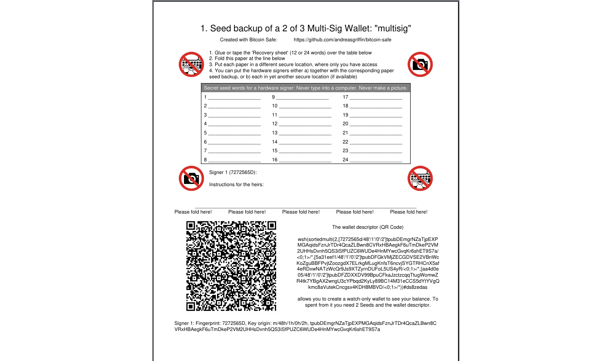
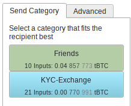

##  
<!--   -->

 
<!--   -->

### ✔ Sichere Bitcoin-Aufbewahrung leicht gemacht 
<!-- - ❌ 2-of-3 Multisignature is complex to use in other wallets -->
<!-- - 2-of-3 Multi-signature is a good choice  
    - Robust against loss or leak of 1 seed  -->
- Der  <a  href= role="button">Setup-Assistent</a>    macht Single- und Multi-Signature für nicht-technische Anwender **einfach**
    --> Befolgen Sie einfach jeden Schritt, um eine sichere Wallet einzurichten.   
    
    - Der <a  href=   role="button">   PDF-Export</a>   hilft Ihnen, den wichtigen Wallet-Deskriptor zusammen mit jedem Seed zu sichern.
    - Registrieren Sie die Multi-Signature mit jedem Hardware-Signer 
    - Beinhaltet Testempfang und -ausgabe aus der Wallet, um sicherzustellen, dass alle wichtigen Hardware-Signer funktionieren
 

 

#### ✔ Label-Synchronisierung und Backup

 sorgt auf magische Weise (durch die Kraft verschlüsselter <a href="https://nostr.com/ ">nostr</a>-Nachrichten) dafür, dass Sie
- <a  href="" role="button">Ihre Münzkategorien und Labels synchronisieren</a> über mehrere Computer hinweg
- Ihre Münzkategorien und Labels sichern. Alles, was Sie tun müssen, ist einen kurzen Backup-Schlüssel zu sichern.
 

 

####  ✔ Mehrparteien-Multi-Sig-Zusammenarbeit

Möchten Sie an einer 3-von-5-Multi-Sig-Wallet teilnehmen?

- Nachdem die Wallet erstellt wurde, erstellt  einen verschlüsselten <a href="https://nostr.com/ ">nostr</a>-Gruppenchat zur Zusammenarbeit und um <a  href="" role="button">PSBTs</a> zum Signieren herumzusenden. 
- Die <a  href="" role="button">Label-Synchronisierung</a> funktioniert natürlich ebenfalls.
- Aus Sicherheitsgründen muss sich jeder Teilnehmer gegenüber jedem anderen Benutzer authentifizieren (ein einfacher Klick).

 

#### ✔ Adressen in Münzkategorien organisieren

  
 
- Sie können Adressen in **Münzkategorien** gruppieren. Das ist einfacher, als jede Adresse einzeln zu beschriften.
- Für jede von Ihnen erstellte PSBT wählen Sie die passende Münzkategorie, und  wählt die Inputs nur daraus aus.   
-  warnt, wenn eine PSBT oder Transaktion Münzkategorien kombiniert.

 

#### ✔ Fehlerquellen ausschließen

In der Vergangenheit wurden viele teure Fehler gemacht. Die meisten davon können verhindert werden, wenn man niemals einen Seed in einen Computer eingibt.  verhindert, dass Sie Seeds auf Ihrem Computer verwenden, und empfiehlt stattdessen die Nutzung eines Hardware-Signers.

-  bietet vollständige Unterstützung für die gängigsten Hardware-Signer (z. B.  <a href="https://store.coinkite.com/promo/8BFF877000C34A86F410">Coldcard</a>, 
            <a href="https://store.coinkite.com/promo/8BFF877000C34A86F410">Coldcard Q</a>, 
            <a href="https://shop.bitbox.swiss/?ref=MOB4dk7gpm">Bitbox02</a>, 
            <a href="https://store.blockstream.com/?code=XEocg5boS77D">Blockstream Jade</a>,    
            <a href="https://trezor.io/trezor-safe-5-bitcoin-only">Trezor Safe</a>,
            <a href="https://foundation.xyz/passport">Foundation Passport</a>,
            <a href="https://keyst.one/?rfsn=8630473.c25550a&utm_source=refersion&utm_medium=affiliate&utm_campaign=8630473.c25550a">Keystone</a>,
            <a href="https://shop.ledger.com/pages/ledger-nano-s-plus">Ledger</a>,
            <a href="https://clavastack.com/en/?coupon=bitcoin-safe">Specter DIY</a>)  
-  enthält Screenshot-Anleitungen für jeden Hardware-Signer, die Sie durch jeden Schritt führen 
    

        
    

   

 

#### ✔ 🔋Alles inklusive🔋 

 ist darauf ausgelegt, einfach zu bedienen zu sein. Dennoch sind alle wichtigen Power-User-Funktionen enthalten.
- Wählen Sie Ihren eigenen Electrum/Esplora-Server, eine Mempool-Instanz und einen Nostr-Relay
- CSV-Import & -Export überall
- RBF, Transaktion abbrechen und Bearbeiten einer finalisierten PSBT
- und noch viel mehr: siehe die <a href="https://github.com/andreasgriffin/bitcoin-safe?tab=readme-ov-file#comprehensive-feature-list">vollständige Funktionsliste</a>

 