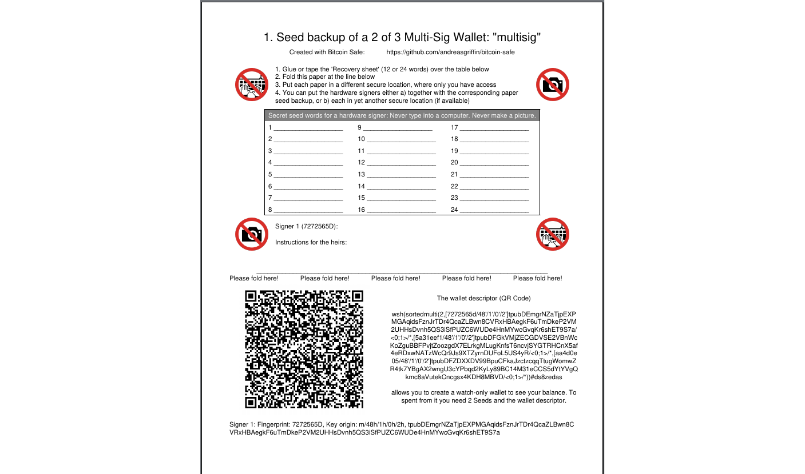
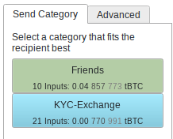

---
aliases:
  - "/features/usps/"
title: "Чому обрати Bitcoin Safe?"
description: "Існує кілька настільних біткоїн-гаманців. Подивіться, чим Bitcoin Safe вирізняється."
draft: false
tags: ["Featured","Features"]
images: ["logo.png"]
keywords: ["bitcoin safe", "unique features", "secure wallet", "user friendly"]
weight: 1000
---

##  
<!--   -->

 
<!--   -->

### ✔ Безпечне зберігання біткоїна стало простим 
<!-- - ❌ 2-of-3 Multisignature is complex to use in other wallets -->
<!-- - 2-of-3 Multi-signature is a good choice  
    - Robust against loss or leak of 1 seed  -->
-  <a  href= role="button">майстер налаштування</a> робить SingleSig і MultiSig **простими** для нетехнічних користувачів
    --> Просто виконуйте кроки, щоб налаштувати безпечний гаманець.   
    
    - <a  href=   role="button">   Експорт PDF</a> допомагає зберігати важливий дескриптор гаманця разом із кожним сидом.
    - Реєструйте мультисиг у кожному апаратному підписувачі 
    - Включає тестове отримання і витрату з гаманця, щоб переконатися, що всі основні апаратні підписувачі працюють
 

 

#### ✔ Синхронізація міток і резервне копіювання

 магічним чином (через силу зашифрованих повідомлень <a href="https://nostr.com/ ">nostr</a>) 
- <a  href="" role="button">синхронізує</a> ваші категорії монет і мітки між комп’ютерами
- Робить резервні копії категорій і міток. Усе, що потрібно — зберегти короткий ключ резервного копіювання.
 

 

####  ✔ Багатостороння співпраця у MultiSig

Брати участь у 3‑з‑5 мультисиг-гаманці?

- Після створення гаманця  створює зашифрований груповий чат <a href="https://nostr.com/ ">nostr</a> для співпраці та <a  href="" role="button">обміну PSBT</a> для підпису.
-  <a  href="" role="button">Синхронізація міток</a> працює, звісно, теж.
- Для безпеки кожен учасник має підтвердити (простим кліком) інших користувачів

 

#### ✔ Організовуйте адреси за категоріями монет

  
 
- Ви можете групувати адреси в **категорії монет**. Це простіше, ніж мітити кожну адресу.
- Для кожного PSBT ви обираєте відповідну категорію, і  вибере входи лише з неї.   
-  попереджає, якщо PSBT або транзакція поєднує різні категорії монет.

 

#### ✔ Мінімізація можливих помилок

Люди вже робили багато дорогих помилок. Більшість з них можна уникнути, якщо **ніколи** не вводити сид на комп’ютері.  забороняє використовувати сіди на комп’ютері та заохочує використання апаратного підписувача.

-  повністю підтримує найпоширеніші апаратні підписувачі (наприклад,  <a href="https://store.coinkite.com/promo/8BFF877000C34A86F410">Coldcard</a>, 
            <a href="https://store.coinkite.com/promo/8BFF877000C34A86F410">Coldcard Q</a>, 
            <a href="https://shop.bitbox.swiss/?ref=MOB4dk7gpm">Bitbox02</a>, 
            <a href="https://store.blockstream.com/?code=XEocg5boS77D">Blockstream Jade</a>,    
            <a href="https://affil.trezor.io/SHtN">Trezor Safe</a>,
            <a href="https://foundation.xyz/passport">Foundation Passport</a>,
            <a href="https://keyst.one/btc-only?rfsn=8630473.c25550a&utm_source=refersion&utm_medium=affiliate&utm_campaign=8630473.c25550a">Keystone</a>,
            <a href="https://shop.ledger.com/?r=400f1fff75b5">Ledger</a>,
            <a href="https://clavastack.com/en/?coupon=bitcoin-safe">Specter DIY</a>)  
-  містить скриншот‑інструкції для кожного апаратного підписувача, щоб провести вас через кожен крок
    

        
    

   

 

#### ✔ 🔋Усе включено🔋 

 розроблено так, щоб ним було легко користуватися. Водночас усі важливі функції для досвідчених користувачів включені.
- Обирайте власний сервер electrum/esplora, інстанс mempool та реле Nostr
- Імпорт і експорт CSV всюди
- RBF, скасування транзакції та редагування фіналізованого PSBT
- і набагато більше: див. <a href="https://github.com/andreasgriffin/bitcoin-safe?tab=readme-ov-file#comprehensive-feature-list">повний список функцій</a>

 
