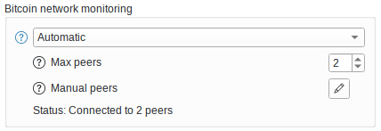

---
aliases:
  - "/knowledge/compact-block-filters/"
title: "Compact Block Filters"
description: "Compact Block Filters let Bitcoin Safe sync privately without exposing your wallet to an Electrum server."
draft: false
tags: ["Featured", "Knowledge" ]
images: ["logo.jpg" ]
keywords:
  - "Bitcoin Safe"
  - "compact block filters"
  - "CBF"
  - "electrum"
  - "privacy"
  - "Bitcoin wallet"
  - "Bitcoin Core"
  - "BDK"
weight: 100
---

## 

**Compact Block Filters (CBF)** let [Bitcoin Safe]() scan the blockchain without asking an Electrum server which addresses belong to you.

{ .img-fluid .float-end .ms-4 .mb-3 style="max-width: 260px;" }

Instead of querying a central server, Bitcoin Safe downloads a small filter for each block from random Bitcoin Core peers. Your wallet checks those filters locally and only downloads full blocks when needed.

### CBF vs Electrum

  <table class="table table-striped align-middle">
    <thead>
      <tr>
        <th scope="col">Feature</th>
        <th scope="col">Compact Block Filters</th>
        <th scope="col">Electrum server</th>
      </tr>
    </thead>
    <tbody>
      <tr>
        <th scope="row">Privacy</th>
        <td>Good - Wallet data stays local</td>
        <td>Bad - Server can learn your addresses and history</td>
      </tr>
      <tr>
        <th scope="row">Data source</th>
        <td>Good - Random Bitcoin Core peers</td>
        <td>Neutral - One chosen server</td>
      </tr>
      <tr>
        <th scope="row">Initial sync</th>
        <td>Neutral - Usually slower</td>
        <td>Good - Usually faster</td>
      </tr>
      <tr>
        <th scope="row">Ongoing sync</th>
        <td>Good - Very fast after the first sync</td>
        <td>Good - Usually quick</td>
      </tr>
      <tr>
        <th scope="row">Best for</th>
        <td>Good - Privacy-focused users</td>
        <td>Good - Fastest setup and recovery</td>
      </tr>
    </tbody>
  </table>

### Why use CBF

- Better privacy: your wallet never asks a server about your addresses.
- No trusted indexer: Bitcoin Safe talks directly to the Bitcoin network.
- Lightweight sync: filters are small, so you do not need the full blockchain.

### What to expect

- New wallet or wallet recovery: usually takes **5 to 30 minutes** for the first sync.
- Already synced wallet: usually catches up **very fast**, often in **under 30 seconds**.
- Switching from Electrum to CBF: usually also **under 30 seconds**.

You can choose how many peers Bitcoin Safe connects to. More peers improve redundancy, but usually increase bandwidth use and sync time. The default is **2** peers.

### Unconfirmed transactions

CBF covers **confirmed blocks only**. To also get alerts for incoming unconfirmed payments, leave [Instant transaction notifications]() enabled, which is the default.

### Technical note

Compact block filters are defined in [BIP158](https://bips.dev/158/). Bitcoin Safe uses the open-source [Kyoto compact block filter module for BDK](https://github.com/2140-dev/kyoto).

You can also use your own Bitcoin Core node as an initial peer in the _Bitcoin network monitoring_ settings.

{ .img-fluid .mb-5   style="max-width: 414px;" }
