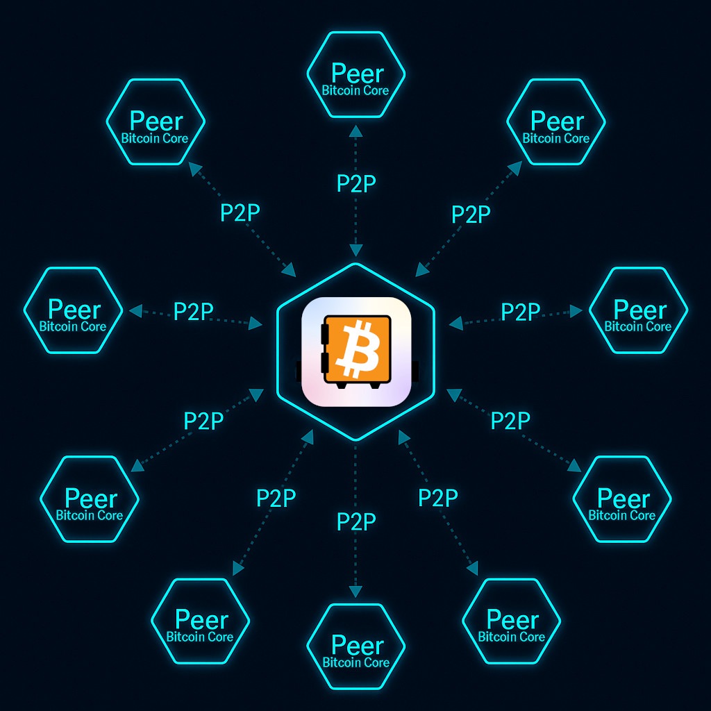

## 

**Penapis Blok Padat (CBF)** membolehkan [Bitcoin Safe]() mengimbas blockchain tanpa bertanya kepada pelayan Electrum alamat yang milik anda.

{ .img-fluid .float-end .ms-4 .mb-3 style="max-width: 260px;" }

Daripada bertanya kepada pelayan pusat, Bitcoin Safe memuat turun penapis kecil untuk setiap blok daripada peer Bitcoin Core rawak. Dompet anda menyemak penapis itu secara tempatan dan hanya memuat turun blok penuh apabila perlu.

### CBF vs Electrum

  <table class="table table-striped align-middle">
    <thead>
      <tr>
        <th scope="col">Aspek</th>
        <th scope="col">Penapis Blok Padat</th>
        <th scope="col">Pelayan Electrum</th>
      </tr>
    </thead>
    <tbody>
      <tr>
        <th scope="row">Privasi</th>
        <td>Baik - Data dompet kekal tempatan</td>
        <td>Buruk - Pelayan boleh melihat alamat dan sejarah anda</td>
      </tr>
      <tr>
        <th scope="row">Sumber data</th>
        <td>Baik - Peer Bitcoin Core rawak</td>
        <td>Neutral - Satu pelayan yang dipilih</td>
      </tr>
      <tr>
        <th scope="row">Penyegerakan awal</th>
        <td>Neutral - Biasanya lebih perlahan</td>
        <td>Baik - Biasanya lebih pantas</td>
      </tr>
      <tr>
        <th scope="row">Penyegerakan berterusan</th>
        <td>Baik - Sangat pantas selepas penyegerakan pertama</td>
        <td>Baik - Biasanya pantas</td>
      </tr>
      <tr>
        <th scope="row">Sesuai untuk</th>
        <td>Baik - Pengguna yang mengutamakan privasi</td>
        <td>Baik - Persediaan dan pemulihan terpantas</td>
      </tr>
    </tbody>
  </table>

### Mengapa guna CBF

- Privasi lebih baik: dompet anda tidak pernah bertanya kepada pelayan alamat anda.
- Tanpa pengindeks yang dipercayai: Bitcoin Safe bercakap terus dengan rangkaian Bitcoin.
- Penyegerakan ringan: penapisnya kecil, jadi anda tidak perlu seluruh blockchain.

### Apa yang dijangka

- Dompet baharu atau pemulihan: biasanya **5 hingga 30 minit** untuk penyegerakan pertama.
- Dompet yang sudah disegerakkan: biasanya mengejar **sangat pantas**, selalunya dalam **kurang daripada 30 saat**.
- Bertukar daripada Electrum ke CBF: biasanya juga **kurang daripada 30 saat**.

Anda boleh memilih berapa banyak peer yang disambungkan oleh Bitcoin Safe. Lebih banyak peer meningkatkan redundansi, tetapi biasanya menambah penggunaan jalur lebar dan masa penyegerakan. Lalai ialah **2** peer.

### Transaksi belum disahkan

CBF hanya meliputi **blok yang telah disahkan**. Untuk juga menerima makluman pembayaran masuk yang belum disahkan, biarkan [Notifikasi transaksi segera]() diaktifkan, kerana itu ialah tetapan lalai.

### Nota teknikal

Penapis blok padat ditakrifkan dalam [BIP158](https://bips.dev/158/). Bitcoin Safe menggunakan modul sumber terbuka [Kyoto compact block filter module for BDK](https://github.com/2140-dev/kyoto).

Anda juga boleh menggunakan nod Bitcoin Core anda sendiri sebagai peer awal dalam tetapan _Bitcoin network monitoring_.

{ .img-fluid .mb-5   style="max-width: 414px;" }
