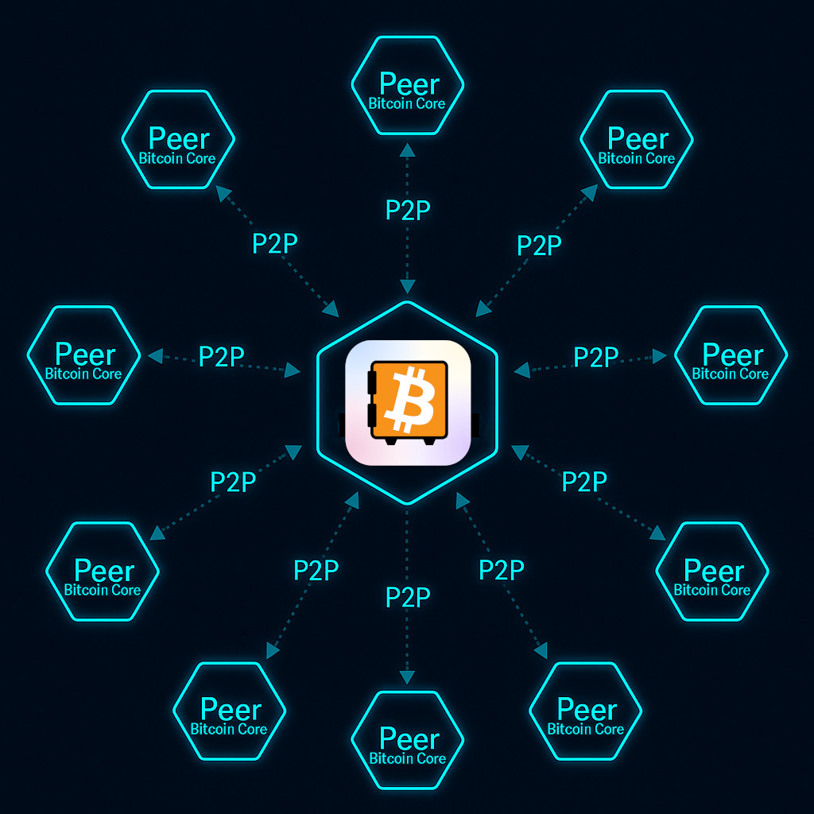
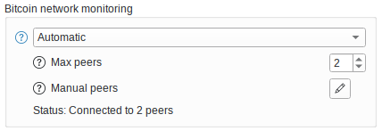

## 

Bitcoin Safe   1.6.0 引入了 **紧凑区块过滤器 (CBF)**，作为一种可选的钱包同步方式。Bitcoin Safe 现在可以直接从随机的 Bitcoin Core 节点下载每个区块的微小摘要文件，而不是向集中式的 Electrum 服务器请求你的钱包历史。这些摘要就像一张简短的检查表，让你的钱包自行判断某个区块是否可能包含你的交易。

因为 [Bitcoin Safe]() 在本地做出判断，任何第三方服务器都不会知道你关心的是哪些地址或交易。你获得的是与完整节点保留的数据同样的确认信息，但以一种更轻量的格式，适合日常设备使用。

**为什么感觉更好：**

- 📦 **下载量小：** 每个过滤器只有几千字节，所以你可以通过普通家用网络同步，而无需存储整个区块链。
- 🔐 **来自网络的直接数据：** [Bitcoin Safe]() 会与多个随机的 Bitcoin Core 节点通信，就像其他节点之间那样，这降低了单一观察者对你进行画像的可能性。
- 🕵️ **本地匹配：** 你的钱包在本地检查这些过滤器。如果某个过滤器看起来相关，才会去获取对应的区块，从而保护你的地址隐私。

相比之下，Electrum 服务器会代表你搜索区块链。每个请求都会将你钱包的地址与服务器操作员共享，服务器可能会记录这些信息。使用紧凑区块过滤器时，Bitcoin Safe 下载的是每个节点都共享的中性数据。没有人能判断哪些地址属于你，因为你的钱包根本不会泄露它们。

下面是启用 CBF 时 [Bitcoin Safe]() 的连接示意图。注意它如何镜像 Bitcoin Core 节点彼此通信的方式：

{ .img-fluid .mb-5   style="max-width: 450px;" }

你可以选择 [Bitcoin Safe]() 应该连接多少个对等节点。更多的对等节点需要更多带宽并会导致同步时间更长。默认值是 2。

 
### 同步时的预期

CBF 会根据你正在做的操作改变等待时间：

1. ✨ **设置或恢复钱包：** 无论你是创建新钱包还是恢复已有钱包，初始同步会下载整个钱包历史的过滤器。根据你的网络速度，预计这个一次性的过程需要 **5 到 30 分钟**。
2. 🚀 **打开已同步的钱包：** [Bitcoin Safe]() 只需要抓取自上次会话以来的新过滤器。这种补齐通常在 **30 秒内** 完成。
3. 🔄 **从 Electrum 服务器切换到 CBF：** 由于钱包之前已经通过 Electrum 服务器同步，Bitcoin Safe 通常只需抓取最新的过滤器，通常 **少于 30 秒**。

### 关注未确认支付

紧凑区块过滤器仅覆盖 **已确认的区块**。如果你希望在交易确认前就收到通知，请确保同时启用 [即时交易通知]()。该功能监听来自随机比特币节点的实时点对点消息，这样你就可以在不放弃隐私的情况下对内存池活动做出反应。

 
 

### 技术细节

- *对于想深入了解的开发者：* 紧凑区块过滤器遵循 [BIP158 规范](https://bips.dev/158/)，并且可参阅 [Elle Mouton 关于 Golomb 编码集合的概述](https://ellemouton.com/posts/bip158/)。Bitcoin Safe 的实现依赖于开源的 [BDK 的 Kyoto 紧凑区块过滤器模块](https://github.com/2140-dev/kyoto)。
- 你可以将自己的 Bitcoin Core 节点添加到用于紧凑区块过滤器同步的对等节点，通过在 _比特币网络监控_ 中选择 _初始节点_ 来实现。

{ .img-fluid .mb-5   style="max-width: 414px;" }