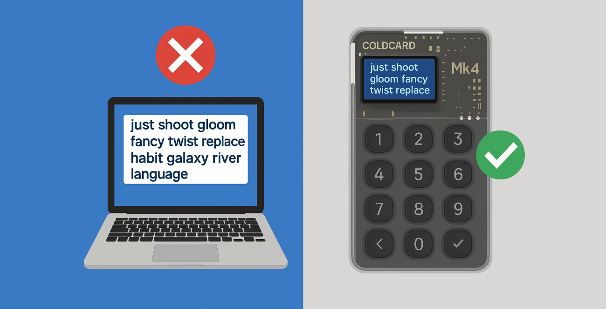

 

{ .img-fluid .mb-5 .float-end style="max-width: 300px;" }

## 🚫 Per què Bitcoin Safe bloqueja les llavors de programari a la Mainnet?

🤔 No és incòmode?

🔥 Resulta que — és una **millora important de seguretat**.

Bitcoin Safe **només permet llavors de programari a Testnet, Signet i Regtest** — mai a la Mainnet. Així és per què:

### ✅ Raons per les quals les llavors de programari estan bloquejades a la Mainnet

- 🧠 **Les llavors de programari no són segures** 
  - Els ordinadors estan plens de riscos: segrestadors del porta-retalls, malware, vulnerabilitats del navegador.
  - Una única errada i la teva llavor queda compromesa — joc acabat.
  - L'emmagatzematge en fred mai no ha d'arrencar en calent.

 

- 🧊 **L'emmagatzematge en fred ha de néixer fred**
  - Els usuaris sovint generen llavors en carteres de programari i després les migren a maquinari.
  - Però l'exposició inicial ja ha passat — no hi ha marxa enrere.
  - Emmagatzematge veritablement en fred = creat en un signant de maquinari des del primer moment.

 

- 🎣 **El phishing prospera amb els hàbits de programari**
  - Escriure llavors en aplicacions t'ensenya a confiar en mals patrons d'UX.
  - L'exigència de maquinari obliga a millors hàbits i limita l'exposició.
  - ✅ Mainnet sense llavors = menys víctimes de phishing.

 

- 🧪 **Els desenvolupadors encara tenen flexibilitat**
  - Les llavors de programari *sí* estan permeses a:
    - Testnet
    - Signet
    - Regtest
  - Ideal per a desenvolupadors. Cap risc per als sats reals. 🧡

 

- 🔐 **La Mainnet requereix signants de maquinari — sense excepcions**
  - 🔌 USB, 📷 QR i 💾 targeta SD amb tots els dispositius principals
    - [Coldcard]()
    - [BitBox02]()
    - [Blockstream Jade]()
    - [Foundation Passport]()
    - [Trezor Safe]()
    - [Ledger]()
    - [Keystone]()
    - [Specter DIY]()
    - [SeedSigner]()
  - [Veure tots els signants compatibles →]()

---

## 🛡️ Protecció contra l'enverinament d'adreces

Bitcoin Safe **codifica amb colors les adreces de recepció** per fer evident l'enverinament d'adreces:

- 🟢 Verd = adreça de recepció verificada  
- 🟡 Groc = adreça de canvi  

Si algú intenta enverinar el teu porta-retalls amb una adreça falsa, ho veuràs al moment.

{ .img-fluid .mb-5 }

---

## ✅ Verificació d'adreces via USB o QR

Verifica les adreces de recepció directament al teu signant de maquinari — no cal confiar en la pantalla.



---

## ✅ Instruccions per a cada signant de maquinari
 
-  inclou captures de pantalla i instruccions per a cada signant de maquinari per guiar-te a cada pas 
    

        
    

   
---

## 🤝 Multisig col·laboratiu fàcil

Bitcoin Safe fa que el multisig sigui fàcil d'usar i apte per a equips:

- 🔐 Xat Nostr xifrat  
- 🔁 Compartir PSBT amb 1 clic  
- 🔌 USB, 📷 QR i 💾 targeta SD



---

## 🛠️ Funcions potents per a tots els usuaris

- 🟧 Assistent per a carteres singlesig  
- 🟨 Configuració multisig 2-de-3  
- 🟩 Qualsevol configuració n-de-m  
- 🖨️ Fulls de còpia de seguretat PDF imprimibles  
- 🔁 Sincronització d'etiquetes via Nostr  
- 🔍 Diagrama complet del flux de diners i historial de transaccions amb cerca

---

## 🌍 Global i fàcil d'usar

- Suport multilingüe: 
- Funciona a: Windows, macOS i Linux  
- Arrossegar i deixar PSBT / CSV  
- Filtres avançats per a transaccions, UTXOs, importos i més

---

## 💡 Resum

Bitcoin Safe = Estalvis reals en Bitcoin:

✅ Maquinari obligatori a la Mainnet  
✅ Cap exposició de llavors de programari  
✅ Multisig accessible per a principiants  
✅ Entorns de prova aptes per a desenvolupadors  
✅ Funcions preparades per a família i equips  

🔗 [Bitcoin-Safe.org]()  
🎥 Canal de YouTube →: https://youtube.com/@BitcoinSafeOrg