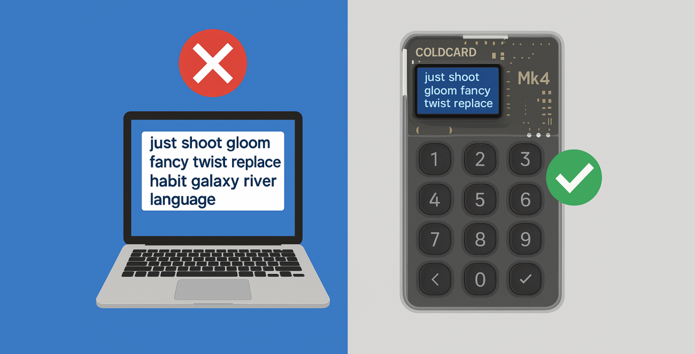

{ .img-fluid .mb-5 .float-end style="max-width: 300px;" }

## 🚫 왜 Bitcoin Safe는 메인넷에서 소프트웨어 시드를 차단하나요?

🤔 불편하지 않나요?

🔥 사실 — 이것은 **중대한 보안 향상**입니다.

Bitcoin Safe는 **메인넷에서는 소프트웨어 시드를 허용하지 않고, 테스트넷(Testnet), 시그넷(Signet), 레그렛(Regtest)에서만 소프트웨어 시드를 허용**합니다. 이유는 다음과 같습니다:

### ✅ 메인넷에서 소프트웨어 시드를 차단하는 이유

- 🧠 **소프트웨어 시드는 안전하지 않습니다**
  - 컴퓨터는 위험 요소로 가득합니다: 클립보드 하이재커, 맬웨어, 브라우저 취약점 등.
  - 한 번의 실수로 시드가 유출되면 — 끝입니다.
  - 콜드 스토리지는 절대 핫 환경에서 시작되어선 안 됩니다.

 

- 🧊 **콜드 스토리지는 처음부터 콜드여야 합니다**
  - 사용자는 종종 소프트웨어 지갑에서 시드를 생성한 뒤 하드웨어로 옮기곤 합니다.
  - 하지만 최초 노출은 이미 발생한 것이며 — 되돌릴 수 없습니다.
  - 진정한 콜드 스토리지는 처음부터 하드웨어 서명기에서 생성되어야 합니다.

 

- 🎣 **피싱은 소프트웨어 습관에서 번성합니다**
  - 앱에 시드를 입력하는 습관은 잘못된 UX 패턴을 신뢰하게 만듭니다.
  - 하드웨어 전용은 더 안전한 습관을 강제하고 노출을 제한합니다.
  - ✅ 메인넷에서의 시드 제거 = 피싱 피해자 감소.

 

- 🧪 **개발자는 여전히 유연성을 가집니다**
  - 소프트웨어 시드는 다음에서 허용됩니다:
    - Testnet
    - Signet
    - Regtest
  - 개발자에게 이상적입니다. 실제 사토시에는 위험이 없습니다. 🧡

 

- 🔐 **메인넷은 하드웨어 서명기를 요구합니다 — 예외 없음**
  - 🔌 USB, 📷 QR, 💾 SD 카드를 통한 모든 주요 기기 지원
    - [Coldcard]()
    - [BitBox02]()
    - [Blockstream Jade]()
    - [Foundation Passport]()
    - [Trezor Safe]()
    - [Ledger]()
    - [Keystone]()
    - [Specter DIY]()
    - [SeedSigner]()
  - [지원되는 모든 서명기 보기 →]()

---

## 🛡️ 주소 포이즈닝(주소 변조) 보호

Bitcoin Safe는 **수신 주소를 색상으로 구분**하여 주소 포이즈닝을 즉시 알아차리게 합니다:

- 🟢 초록 = 검증된 수신 주소  
- 🟡 노랑 = 체인지 주소  

누군가가 클립보드를 위조된 주소로 오염시키려 해도, 즉시 확인할 수 있습니다.

{ .img-fluid .mb-5 }

---

## ✅ USB 또는 QR을 통한 주소 검증

수신 주소를 하드웨어 서명기에서 직접 검증하세요 — 화면을 신뢰할 필요가 없습니다.



---

## ✅ 각 하드웨어 서명기별 안내

-  는 각 하드웨어 서명기별 스크린샷과 지침을 포함하여 모든 단계를 안내합니다 
    

        
    

   
---

## 🤝 협업형 멀티시그를 쉽게

Bitcoin Safe는 멀티시그를 사용자 친화적이고 팀에 적합하게 만듭니다:

- 🔐 암호화된 Nostr 채팅  
- 🔁 원클릭 PSBT 공유  
- 🔌 USB, 📷 QR, 💾 SD 카드



---

## 🛠️ 모든 사용자를 위한 강력한 기능

- 🟧 싱글시그 지갑 마법사  
- 🟨 2-of-3 멀티시그 설정  
- 🟩 임의의 n-of-m 구성 지원  
- 🖨️ 인쇄 가능한 PDF 백업 시트  
- 🔁 Nostr를 통한 라벨 동기화  
- 🔍 전체 자금 흐름 다이어그램 및 검색 가능한 거래 기록

---

## 🌍 글로벌하고 사용자 친화적

- 다국어 지원: 
- 작동 환경: Windows, macOS & Linux  
- 드래그 앤 드롭 PSBT / CSV  
- 거래, UTXO, 금액 등 고급 필터

---

## 💡 요약 (TL;DR)

Bitcoin Safe = 진짜 비트코인 보관:

✅ 메인넷에서는 하드웨어 전용  
✅ 소프트웨어 시드 노출 없음  
✅ 초보자 친화적 멀티시그  
✅ 개발자 친화적 테스트 환경  
✅ 가족 및 팀용 기능 완비  

🔗 [Bitcoin-Safe.org](https://Bitcoin-Safe.org)  
🎥 YouTube 채널 →: https://youtube.com/@BitcoinSafeOrg