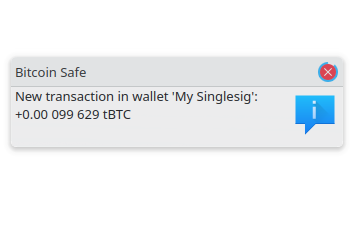
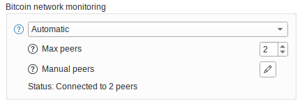

{ .img-fluid .mb-5 .float-end style="max-width: 300px;" }

###   
 
  

**Bitcoin Safe** (a partire dalla versione **1.5.0**) supporta le notifiche istantanee delle transazioni Bitcoin in arrivo rilevanti per il tuo portafoglio. Ecco come funziona sotto il cofano:

##### 1. 📡 Ascolto della rete P2P di Bitcoin

Bitcoin Safe si connette direttamente a uno o più **nodi Bitcoin Core**, che partecipano alla rete globale **peer-to-peer (P2P)**. Questi nodi scambiano continuamente le nuove transazioni trasmesse destinate a essere incluse nella **mempool**.

Bitcoin Safe ascolta in modo passivo questi messaggi di broadcast e verifica se:

* una qualsiasi transazione coinvolge **indirizzi** o **UTXO** del tuo portafoglio.

✅ **Rispetto della privacy**
Questo metodo è **completamente privato**. Non **rivela nulla** sul tuo portafoglio al mondo esterno.
Bitcoin Safe si comporta esattamente come un normale nodo Bitcoin Core: ascolta solamente il traffico P2P pubblico — senza mai annunciare o richiedere nulla di specifico riguardo al tuo portafoglio.

##### 2. 🧠 Trovata una corrispondenza — Cosa succede dopo?

Se viene trovata una transazione corrispondente, Bitcoin Safe reagirà in modo differente a seconda del backend che stai usando:

###### Opzione A: ⚡ Backend Electrum o Esplora

* Bitcoin Safe **avvierà una sincronizzazione in background** per recuperare la transazione completa e lo stato del portafoglio dal server.

###### Opzione B: 🔍 Filtri di blocco compatti (Modalità Neutrino)

* Il portafoglio **aggiungerà direttamente la transazione non confermata** ai dati locali del tuo portafoglio — non è necessaria alcuna ricerca aggiuntiva.

#### ⚙️ Comportamento Opt-In / Opt-Out

Per rispettare le preferenze degli utenti e le impostazioni di privacy:

* 🔒 **Per gli utenti esistenti** che eseguono l'aggiornamento alla versione 1.5.0 o successive, questa funzione è **disattivata per impostazione predefinita (opt-in)** — puoi abilitarla manualmente nelle impostazioni di rete.
* 🚀 **Per i nuovi utenti**, questa funzionalità è **attivata per impostazione predefinita (opt-out)**, poiché è sia **rispettosa della privacy** sia **molto utile** per monitorare in tempo reale l'attività del portafoglio.

Rimani pienamente in controllo e puoi attivare o disattivare questa funzione in qualsiasi momento.
 
 

{ .img-fluid .mb-5 }

#### ⚠️ Solo le transazioni confermate possono essere ritenute affidabili

Bitcoin Safe non può verificare che una transazione trasmessa sia valida. Un attaccante — specialmente uno che controlla sia il tuo server Electrum sia il nodo Bitcoin a cui sei connesso — potrebbe:

* Creare una transazione fasulla che coinvolga il tuo indirizzo
* Trasmetterla per innescare una notifica nel portafoglio
* Far sì che non venga mai confermata, perché è **non valida** o **in conflitto con le regole di consenso**

  

#### ✅ Riepilogo

A partire dalla versione **1.5.0**, Bitcoin Safe supporta le notifiche istantanee delle transazioni tramite:

* Ascolto passivo della rete P2P di Bitcoin (come Bitcoin Core)
* Corrispondenza delle transazioni che coinvolgono gli **indirizzi** o gli **UTXO** del tuo portafoglio
* Recupero dei dettagli completi tramite Electrum/Esplora o aggiunta diretta tramite i Filtri di Blocco Compatti
* Nessuna rivelazione dei dati del portafoglio al mondo esterno