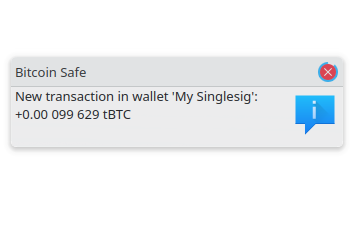

{ .img-fluid .mb-5 .float-end style="max-width: 300px;" }

###   
 
  

**Bitcoin Safe** (od wersji **1.5.0**) obsługuje natychmiastowe powiadamianie o przychodzących transakcjach Bitcoina istotnych dla twojego portfela. Oto jak to działa „pod maską”:

##### 1. 📡 Nasłuchiwanie sieci P2P Bitcoina

Bitcoin Safe łączy się bezpośrednio z jednym lub kilkoma **węzłami Bitcoin Core**, które uczestniczą w globalnej **sieci peer-to-peer (P2P)**. Węzły te nieustannie wymieniają się nowo nadawanymi transakcjami przeznaczonymi do umieszczenia w **mempoolu**.

Bitcoin Safe nasłuchuje pasywnie tych komunikatów broadcast i sprawdza, czy:

* jakakolwiek transakcja dotyczy **adresów** lub **UTXO** z Twojego portfela.

✅ **Zachowanie prywatności**
Ta metoda jest **całkowicie prywatna**. Nie ujawnia **niczego** na temat Twojego portfela światu zewnętrznemu.
Bitcoin Safe zachowuje się dokładnie jak zwykły węzeł Bitcoin Core: jedynie nasłuchuje publicznego ruchu P2P — nigdy nie ogłasza ani nie żąda niczego specyficznego dla Twojego portfela.

##### 2. 🧠 Znaleziono dopasowanie — co się dzieje dalej?

Jeśli zostanie znaleziona pasująca transakcja, Bitcoin Safe zareaguje inaczej w zależności od używanego backendu:

###### Opcja A: ⚡ Backend Electrum lub Esplora

* Bitcoin Safe wywoła **synchronizację w tle**, aby pobrać pełną transakcję i stan portfela z serwera.

###### Opcja B: 🔍 Filtry kompaktowych bloków (tryb Neutrino)

* Portfel **bezpośrednio doda niepotwierdzoną transakcję** do lokalnych danych portfela — nie jest potrzebne dalsze wyszukiwanie.

#### ⚙️ Zachowanie opt-in / opt-out

Aby uszanować preferencje użytkownika i ustawienia prywatności:

* 🔒 **Dla istniejących użytkowników** aktualizujących do wersji 1.5.0 lub nowszej, ta funkcja jest **domyślnie wyłączona (wymaga opt-in)** — możesz ją włączyć ręcznie w ustawieniach sieci.
* 🚀 **Dla nowych użytkowników**, ta funkcja jest **domyślnie włączona (opt-out)**, ponieważ jednocześnie **chroni prywatność** i jest **bardzo przydatna** do śledzenia aktywności portfela w czasie rzeczywistym.

Masz pełną kontrolę i możesz w dowolnym momencie przełączyć tę funkcję.
 
 

{ .img-fluid .mb-5 }

#### ⚠️ Tylko potwierdzone transakcje są wiarygodne

Bitcoin Safe nie jest w stanie samodzielnie zweryfikować, że nadana (broadcast) transakcja jest poprawna. Atakujący — szczególnie taki, który kontroluje zarówno Twój serwer Electrum, jak i węzeł Bitcoin, z którym jesteś połączony — mógłby:

* Sfałszować transakcję dotyczącą Twojego adresu
* Nadać ją, aby wywołać powiadomienie w portfelu
* Sprawić, by nigdy się nie potwierdziła, ponieważ jest **nieprawidłowa** lub **koliduje z regułami konsensusu**

  

#### ✅ Podsumowanie

Od wersji **1.5.0**, Bitcoin Safe obsługuje natychmiastowe powiadomienia o transakcjach poprzez:

* Pasywne nasłuchiwanie sieci P2P Bitcoina (jak Bitcoin Core)
* Dopasowywanie transakcji dotyczących **adresów** lub **UTXO** Twojego portfela
* Pobieranie pełnych danych przez Electrum/Esplora lub bezpośrednie dodawanie przez filtry kompaktowych bloków
* Nigdy nie ujawniając żadnych danych portfela na zewnątrz