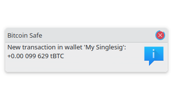
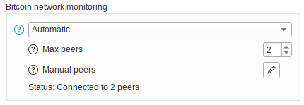

---
aliases:
  - "/knowledge/instant-transactions-notifications/"
title: "Миттєві сповіщення про транзакції"
description: "Як Bitcoin Safe отримує миттєві сповіщення про транзакції"
draft: false
tags: ["Knowledge" ]
# Download the logo from here https://i.ytimg.com/vi/xxxxxxxx/maxresdefault.jpg
images: ["logo.png" ]
keywords: [
  "secure Bitcoin wallet for families",
  "bitcoin",
  "bitcoin saving",
  "hardware signer",
  "Bitcoin Custodians",
  "Financial Advisors",
  "bitcoin wallet",
  "trezor",
  "usa bitcoin",
  "BTC",
  "HODL",
  "BitcoinSecurity",
  "Instant transaction notifications"
]

# embedding videos can be done with 
# 
# or the list will be rendered below the content
# videos:
#   - "https://www.youtube.com/watch?v=GykmXP6Z1zM"
weight: 0
---

{ .img-fluid .mb-5 .float-end style="max-width: 300px;" }

###   
 
  

**Bitcoin Safe** (починаючи з версії **1.5.0**) підтримує миттєві сповіщення про вхідні біткоїн‑транзакції, пов’язані з вашим гаманцем. Ось як це працює «під капотом»:

##### 1. 📡 Прослуховування P2P‑мережі Bitcoin

Bitcoin Safe підключається безпосередньо до одного або кількох вузлів **Bitcoin Core**, які беруть участь у глобальній **peer‑to‑peer (P2P)** мережі. Ці вузли постійно обмінюються новими трансляційними транзакціями, призначеними для включення в **mempool**.

Bitcoin Safe пасивно слухає ці повідомлення та перевіряє, чи:

* будь‑яка транзакція містить **адреси** або **UTXO** з вашого гаманця.

✅ **Збереження приватності**
Цей метод є **повністю приватним**. Він **не розкриває нічого** про ваш гаманець зовнішньому світу.
Bitcoin Safe поводиться як звичайний вузол Bitcoin Core: він лише слухає публічний P2P‑трафік — ніколи не оголошує і не запитує нічого, що стосується вашого гаманця.

##### 2. 🧠 Знайдено збіг — що далі?

Якщо знайдена відповідна транзакція, Bitcoin Safe реагує по‑різному залежно від бекенду, який ви використовуєте:

###### Варіант A: ⚡ Electrum або Esplora

* Bitcoin Safe **запускає фонову синхронізацію**, щоб отримати повну транзакцію та стан гаманця з сервера.

###### Варіант B: 🔍 Compact Block Filters (режим Neutrino)

* Гаманець **безпосередньо додає непідтверджену транзакцію** у локальні дані — без додаткового запиту.

#### ⚙️ Opt‑in / Opt‑out поведінка

Щоб поважати налаштування приватності користувача:

* 🔒 **Для існуючих користувачів**, які оновилися до версії 1.5.0 або новішої, ця функція **вимкнена за замовчуванням (opt‑in)** — її можна ввімкнути вручну в налаштуваннях мережі.
* 🚀 **Для нових користувачів** ця функція **увімкнена (opt‑out)** за замовчуванням, оскільки вона **приватна** та **дуже корисна** для відстеження активності гаманця в реальному часі.

Ви повністю контролюєте цю функцію і можете перемикати її в будь‑який момент.
 

{ .img-fluid .mb-5 }

#### ⚠️ Довіряти можна лише підтвердженим транзакціям

Bitcoin Safe **не може** перевірити, чи трансляційна транзакція є валідною. Зловмисник — особливо той, хто контролює і ваш сервер Electrum, і вузол Bitcoin, до якого ви підключені — може:

* Створити фейкову транзакцію, що містить вашу адресу
* Розіслати її, щоб викликати сповіщення гаманця
* Зробити так, щоб вона ніколи не підтвердилась, бо є **недійсною** або **суперечить правилам консенсусу**

  

#### ✅ Підсумок

Починаючи з версії **1.5.0**, Bitcoin Safe підтримує миттєві сповіщення про транзакції завдяки:

* Пасивному прослуховуванню P2P‑мережі Bitcoin (як Bitcoin Core)
* Пошуку транзакцій, що містять **адреси** або **UTXO** вашого гаманця
* Отриманню повних деталей через Electrum/Esplora або прямому додаванню через Compact Block Filters
* Жодному розкриттю даних гаманця зовнішньому світу
