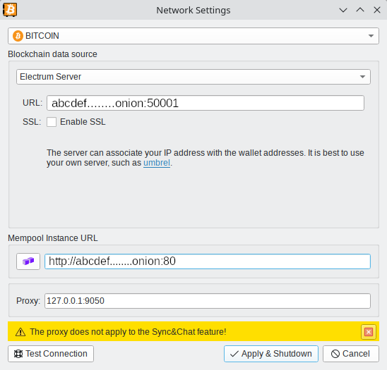

###   
 

- Ustaw proxy na `127.0.0.1:9050`, jeśli masz działający Tor  
- Ustaw serwer Electrum na `abcdef.onion:50001`, gdzie `50001` to domyślny port dla niezaszyfrowanego transportu Electrum  (i tak Tor jest szyfrowany)
- Ustaw instancję mempool.space na `http://abcdef.onion` lub `http://abcdef.onion:80` (powinno też działać w przeglądarce Tor)

  

 
 
 { .img-fluid .mb-5 }