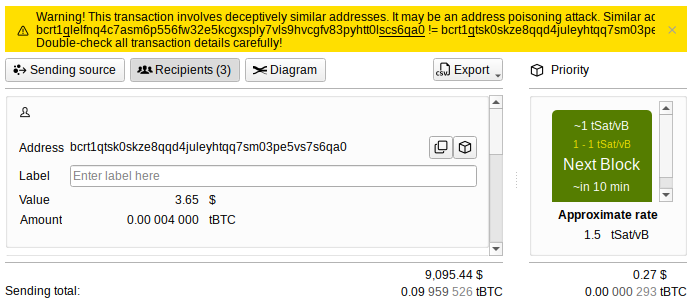

---
aliases:
  - "/uk/features/address-poisoning/"
title: "Виявлення отруєння адреси"
description: "Зловмисники можуть надсилати транзакції з адресами, схожими на вашу. Bitcoin-Safe попередить про це"
draft: false
bucket: features
images: ["logo.png"]
keywords: ["address poisoning", "phishing", "dust attack", "wallet protection"]
---

###  
 

 

{ .img-fluid .mb-5 }
