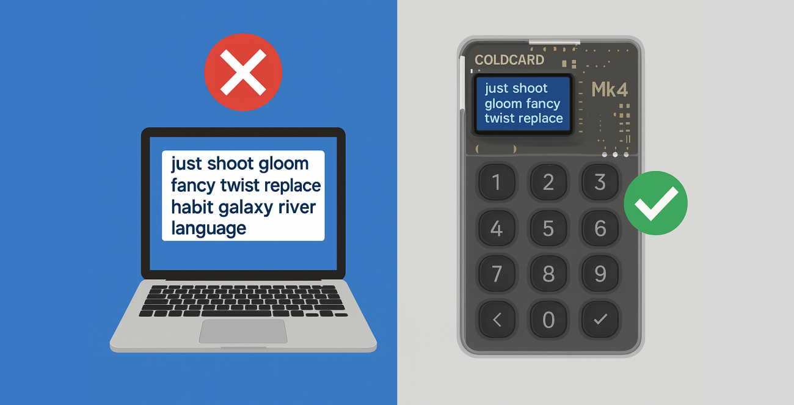

---
aliases:
  - "/th/knowledge/hardware-signer-only/"
title: "ต้องใช้ฮาร์ดแวร์ซายน์เนอร์"
description: "Bitcoin Safe กำหนดให้ใช้ seed จากฮาร์ดแวร์เท่านั้นบน Mainnet เพื่อเพิ่มความปลอดภัยสูงสุดและหลีกเลี่ยงความเสี่ยงจากการเก็บคีย์ด้วยซอฟต์แวร์ — นี่คือเหตุผลที่สำคัญ"
draft: false
bucket: knowledge
tags: ["Featured"]
keywords: [
  "Bitcoin Safe",
  "กระเป๋าเงินฮาร์ดแวร์",
  "seed แบบซอฟต์แวร์",
  "Coldcard",
  "Trezor",
  "SeedSigner",
  "multisig",
  "PSBT",
  "การควบคุมเงินด้วยตนเอง",
  "ความปลอดภัยของ Bitcoin",
  "การปลอมที่อยู่",
  "เครื่องมือ Bitcoin"
]
images: ["logo.png" ]
# embedding videos can be done with 
# 
# or the list will be rendered below the content
# videos:
#   - "https://www.youtube.com/watch?v=dbSmQmt0uDI"
weight: 21
---

 

{ .img-fluid .mb-5 .float-end style="max-width: 300px;" }

## 🚫 ทำไม Bitcoin Safe ถึงบล็อก seed แบบซอฟต์แวร์บน Mainnet?

🤔 มันไม่สะดวกใช่ไหม?

🔥 ผลคือ — นี่คือการอัปเกรดความปลอดภัยครั้งใหญ่

Bitcoin Safe **อนุญาตให้ใช้ seed แบบซอฟต์แวร์ได้เฉพาะบน Testnet, Signet และ Regtest** — แต่ไม่เคยบน Mainnet นี่คือเหตุผล:

### ✅ เหตุผลที่บล็อก seed แบบซอฟต์แวร์บน Mainnet

- 🧠 **seed แบบซอฟต์แวร์ไม่ปลอดภัย**
  - คอมพิวเตอร์เต็มไปด้วยความเสี่ยง: โจมตีจากการแฮ็กคลิปบอร์ด มัลแวร์ และช่องโหว่ของเบราว์เซอร์
  - เพียงความผิดพลาดครั้งเดียว seed ของคุณอาจถูกเปิดเผย — หมดสิทธิ์คืน
  - การจัดเก็บแบบเย็นไม่ควรเริ่มจากสภาพแวดล้อมที่ร้อน

 

- 🧊 **Cold storage ต้องเริ่มเย็นตั้งแต่แรก**
  - ผู้ใช้มักสร้าง seed ในกระเป๋าเงินซอฟต์แวร์แล้วย้ายไปยังฮาร์ดแวร์
  - แต่การเปิดเผยครั้งแรกนั้นเกิดขึ้นแล้ว — ไม่สามารถย้อนกลับได้
  - การเก็บแบบ Cold ที่แท้จริง = สร้างบนฮาร์ดแวร์ซายน์เนอร์ตั้งแต่ต้น

 

- 🎣 **ฟิชชิ่งเติบโตจากพฤติกรรมการใช้ซอฟต์แวร์**
  - การพิมพ์ seed เข้าไปในแอปทำให้คุณฝึกนิสัยไว้วางใจ UI ที่ไม่ปลอดภัย
  - การบังคับใช้ฮาร์ดแวร์เท่านั้นช่วยสร้างนิสัยที่ปลอดภัยขึ้นและลดการเปิดเผย
  - ✅ ไม่มี seed บน Mainnet = เหยื่อฟิชชิ่งน้อยลง

 

- 🧪 **นักพัฒนายังมีความยืดหยุ่น**
  - seed แบบซอฟต์แวร์ *ได้รับอนุญาต* บน:
    - Testnet
    - Signet
    - Regtest
  - เหมาะสำหรับนักพัฒนา ไม่มีความเสี่ยงต่อ sat จริง 🧡

 

- 🔐 **Mainnet ต้องใช้ฮาร์ดแวร์ซายน์เนอร์ — ไม่มีข้อยกเว้น**
  - 🔌 USB, 📷 QR และ 💾 SD card กับอุปกรณ์หลักทั้งหมด
    - [Coldcard]()
    - [BitBox02]()
    - [Blockstream Jade]()
    - [Foundation Passport Core]()
    - [Trezor Safe]()
    - [Ledger]()
    - [Keystone]()
    - [Specter DIY]()
    - [SeedSigner]()
  - [ดูอุปกรณ์ซายน์เนอร์ที่รองรับทั้งหมด →]()

---

## 🛡️ การป้องกันการปลอมที่อยู่

Bitcoin Safe **ทำการแยกสีของที่อยู่รับเงิน** เพื่อให้การปลอมที่อยู่สังเกตเห็นได้ชัดเจน:

- 🟢 เขียว = ที่อยู่รับที่ยืนยันแล้ว  
- 🟡 เหลือง = ที่อยู่สำหรับเงินทอน  

ถ้ามีคนพยายามปลอมที่อยู่ในคลิปบอร์ดของคุณ คุณจะเห็นได้ทันที

{ .img-fluid .mb-5 }

---

## ✅ ยืนยันที่อยู่ผ่าน USB หรือ QR

ยืนยันที่อยู่รับโดยตรงบนฮาร์ดแวร์ซายน์เนอร์ของคุณ — ไม่ต้องไว้ใจหน้าจอของแอป



---

## ✅ คำแนะนำสำหรับแต่ละฮาร์ดแวร์ซายน์เนอร์
 
-  มีภาพหน้าจอและคำแนะนำสำหรับแต่ละฮาร์ดแวร์ซายน์เนอร์ เพื่อแนะนำคุณในทุกขั้นตอน 
    

        
    

   
---

## 🤝 การทำ multisig ร่วมกันที่ง่ายขึ้น

Bitcoin Safe ทำให้ multisig เป็นมิตรกับผู้ใช้และพร้อมสำหรับทีม:

- 🔐 แชท Nostr แบบเข้ารหัส  
- 🔁 แชร์ PSBT ด้วยคลิกเดียว  
- 🔌 USB, 📷 QR และ 💾 SD card



---

## 🛠️ ฟีเจอร์ทรงพลังสำหรับทุกคน

- 🟧 ตัวช่วยสร้างกระเป๋าเงินแบบ singlesig  
- 🟨 การตั้งค่า multisig แบบ 2 ใน 3  
- 🟩 การกำหนดค่า any n-of-m  
- 🖨️ แผ่นสำรอง PDF ที่พิมพ์ได้  
- 🔁 ซิงค์ป้ายกำกับผ่าน Nostr  
- 🔍 แผนภาพการไหลของเงินแบบเต็ม & ประวัติรายการที่ค้นหาได้

---

## 🌍 รองรับทั่วโลกและใช้งานง่าย

- รองรับหลายภาษา: 
- ใช้งานบน: Windows, macOS & Linux  
- ลากแล้ววาง PSBT / CSV  
- ตัวกรองขั้นสูงสำหรับรายการ, UTXO, จำนวนเงิน และอื่นๆ

---

## 💡 สรุปสั้นๆ

Bitcoin Safe = การออม Bitcoin ของแท้:

✅ ฮาร์ดแวร์เท่านั้นบน Mainnet  
✅ ไม่มีการเปิดเผย seed แบบซอฟต์แวร์  
✅ multisig สำหรับผู้เริ่มต้น  
✅ สภาพแวดล้อมทดสอบสำหรับนักพัฒนา  
✅ ฟีเจอร์พร้อมสำหรับครอบครัว & ทีม  

🔗 [Bitcoin-Safe.org]()  
🎥 YouTube channel →: https://youtube.com/@BitcoinSafeOrg