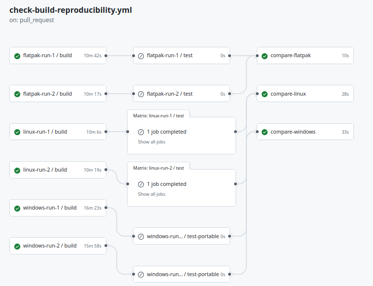

---
aliases:
  - "/tr/features/reproducibility-and-security/"
title: "Guvenlik ve yeniden uretilebilirlik"
description: "Bitcoin Safe, yeniden uretilebilir buildler, imzali commitler, imzali surumler ve bagimsiz dis izleme dahil olmak uzere yuksek bir binary guvenlik standardi izler."
draft: false
bucket: features
tags: ["Featured", "Security"]
images: ["logo.png"]
keywords: ["reproducible builds", "verify binaries", "signed commits", "signed releases", "appimage", "flatpak", "windows exe", "binary security"]
weight: 18
---

### 

 

{ .img-fluid .mb-5 .float-end style="max-width: 500px;" }

Web sitesinden indirdiginiz uygulamanin acik kaynak koduyla gercekten eslesmesini saglamak icin, indirmelerin butunlugunu koruyan birden fazla katman uyguladik:

- **Yeniden uretilebilir buildler**: Linux `deb`, `AppImage` ve `Flatpak` buildleri ile Windows `portable exe` ve `setup exe` dosyalari byte-for-byte yeniden uretilebilir. Yeniden olusturulan bir dosya tam olarak eslesiyorsa, bu binary'nin ayni kaynak koddan uretildigine dair guclu bir kanittir.
- **Imzali depo gecmisi**: [Bitcoin Safe GitHub deposu](https://github.com/andreasgriffin/bitcoin-safe/commits/main) dogrulanmis imzali commitler yayimlar; boylece inceleme yapanlar bir surume giren kodu kimin yazdigini kontrol edebilir.
- **Imzali binary'ler**: Surum dosyalari Bitcoin Safe'in [genel PGP anahtari]() ile imzalanir ve Windows binary'leri de [kod imzalama politikasini]() takip eder.
- **Bagimsiz yeniden uretilebilirlik kontrolleri**: [WalletScrutiny](https://walletscrutiny.com/desktop/bitcoin.safe/) Bitcoin Safe'i bagimsiz olarak izler ve masaustu surumleri icin yeniden uretilebilir dogrulama durumunu gosterir.
- **Surekli imza izlemesi**: [BinaryWatch](https://binarywatch.org/) Bitcoin Safe surum dosyalarini ve imzalarinin Bitcoin Safe'in [genel PGP anahtarina]() gore hala gecerli olup olmadigini duzenli olarak kontrol eder.
- **Guncelleme dogrulamasi**: Guncellemeler Bitcoin Safe icinde gosterilir ve imzalari otomatik olarak dogrulanir.

Bu onlemler bir araya geldiginde, Bitcoin Safe'i binary guvenligini kullanici guvenliginin temel bir parcasi olarak ele alan az sayidaki projeden biri haline getirir.

### Guvenlik, Bitcoin Safe'in her yonunde temel degerlendirmedir

Binary butunlugunun otesinde, Bitcoin Safe guvenli varsayilanlar, iyi operasyonel uygulamalar ve acik kullanici rehberligi etrafinda tasarlanmistir. Birkac ornek:

- **Donanim odakli saklama**: Bitcoin Safe [hardware signer]() gerektirir; boylece seed'ler genel amacli bir bilgisayarda sicak sirlara donusmek yerine ozel cihazlarda kalir.
- **Daha guvenli kurulum akisi**: Kurulum sihirbazi, [hardware signer]() testleri, [PDF yedek sayfalari]() ve cihazlar ile seed yedeklerinin nasil saklanacagina dair yonlendirmeler dahil olmak uzere gercek kullanim icin hazir wallet'lar olusturmaya yardimci olur.
- **Alim adresi dogrulamasi**: Bitcoin Safe, paylasmadan once [alim adreslerini dogrudan signer uzerinde dogrulamayi]() kolaylastirir.
- **Address poisoning tespiti**: Supheli [benzer gorunumlu adresler]() konusunda uyarir.
- **Multisig guvenligi**: Bitcoin Safe multisig wallet'lari destekler; boylece daha buyuk bakiyeler tek bir hata noktasina bagli kalmak yerine birden fazla cihaz veya kisi tarafindan korunabilir.
- **Multisig'i kolaylastiran isbirligi**: Bitcoin Safe [multisig isbirligini]() pratik hale getirir; boylece gercek kullanimda kurulum ve imzalama koordinasyonu cok daha kolay olur.
- **Net imzalama akislari**: Cihaza ozel imzalama ekranlari, PSBT incelemesi sirasinda karisikligi azaltir ve kullanicilarin dogru signer uzerinde dogru islemi yapmasina yardimci olur.
