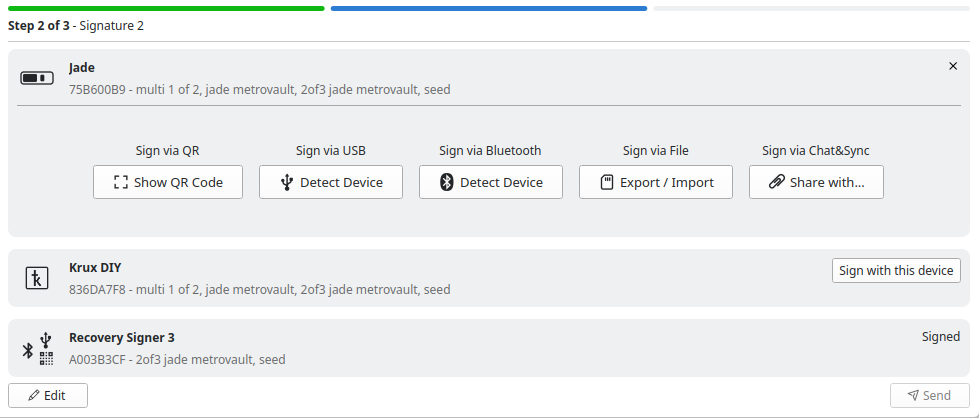
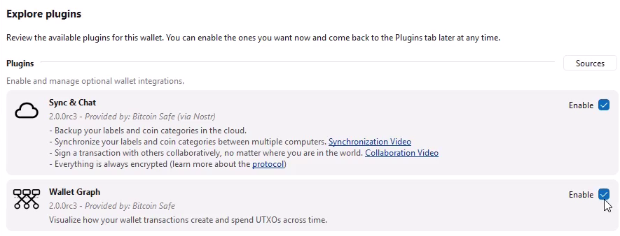

  

    
اعلام انتشار

    <h2 class="display-6 mb-3">Bitcoin-Safe 2.0 - راه‌اندازی هدایت‌شده کیف‌پول، همگام‌سازی خصوصی زنجیره، و امضای متمرکز بر دستگاه</h2>
    
این نسخه یک راه‌انداز کاملاً بازسازی‌شده، همگام‌سازی خصوصی زنجیره با Compact Block Filters، و جریان امضایی که حول هر دستگاه سخت‌افزاری سازمان‌دهی شده است را ارائه می‌کند. اگر به cold storage کنجکاو بودید اما هنوز مطمئن نبودید، این همان نسخه‌ای است که ارزش امتحان کردن دارد.

    

      <a class="btn btn-primary btn-lg px-4" href='' role="button">دانلود Bitcoin-Safe 2.0</a>
      <a class="btn btn-outline-primary btn-lg px-4" href="#setup-flow" role="button">مشاهده چیزهای جدید</a>
    

  

  

    <a class="text-decoration-none text-reset d-block h-100" href="#setup-flow">
      

        

          <h2 class="h5">راه‌اندازی کیف‌پول به‌صورت مرحله‌به‌مرحله</h2>
          
راه‌انداز جدید هر مرحله را توضیح می‌دهد، ابهام را کمتر می‌کند و به کاربران جدید کمک می‌کند بدون از دست دادن قدرت multisig مسیر درست را انتخاب کنند.

        

      

    </a>
  

  

    <a class="text-decoration-none text-reset d-block h-100" href="#private-sync-default">
      

        

          <h2 class="h5">همگام‌سازی خصوصی کیف‌پول</h2>
          
کیف‌پول‌های جدید اکنون به‌صورت پیش‌فرض با Compact Block Filters همگام می‌شوند، تا بتوانید زنجیره را به‌صورت خصوصی اسکن کنید بدون اینکه به یک Electrum indexer شخص ثالث تکیه کنید.

        

      

    </a>
  

  

    <a class="text-decoration-none text-reset d-block h-100" href="#device-focused-signing">
      

        

          <h2 class="h5">امضای متمرکز بر دستگاه</h2>
          
جریان‌های امضا اکنون حول دستگاهی که روبه‌روی شماست می‌چرخند و گام‌های بعدی روشن‌تری برای QR، USB، Bluetooth، فایل‌ها و هماهنگی multisig نشان می‌دهند.

        

      

    </a>
  

  
## مسیری هدایت‌شده به سمت self-custody {#setup-flow}

تجربه اولین اجرا از نو ساخته شده است. Bitcoin-Safe همچنان برای self-custody جدی طراحی شده، از جمله multisig مبتنی بر سخت‌افزار، و نسخه 2.0 اکنون مسیری هدایت‌شده برای عبور از این فرایند به کاربران جدید می‌دهد. راه‌انداز جدید توضیح می‌دهد چه اتفاقی در حال رخ دادن است، شما در کدام بخش از فرایند هستید و هر signer پیش از ادامه چه چیزی از شما نیاز دارد.

برای جزئیات پیاده‌سازی، به <a href="https://github.com/andreasgriffin/bitcoin-safe/pull/627">PR #627</a> مراجعه کنید.

نکات برجسته بازطراحی:

- صفحه خوش‌آمدگویی جدید که به کاربران بار اولی کمک می‌کند نقطه شروع درست را انتخاب کنند
- جریان پیشرفت مرحله‌به‌مرحله هنگام ساخت کیف‌پول
- صفحه‌های امضای مخصوص دستگاه با دستورالعمل‌های متمرکز و کمک زمینه‌ای
- فایل‌های recovery PDF با نام و آیکون دستگاه‌ها تا پشتیبان‌ها بدون ابهام بمانند



  
## همگام‌سازی خصوصی و پایدار زنجیره با Compact Block Filters {#private-sync-default}

[Compact Block Filters]() اکنون موتور همگام‌سازی کیف‌پول‌های جدید در Bitcoin-Safe 2.0 هستند. به‌جای اینکه از Electrum server بپرسید کدام آدرس‌ها متعلق به شما هستند، Bitcoin-Safe اکنون می‌تواند زنجیره را به‌صورت خصوصی اسکن کند؛ با دانلود compact filters از Bitcoin Core peers تصادفی و بررسی محلی آن‌ها.

برای جزئیات پیاده‌سازی، به <a href="https://github.com/andreasgriffin/bitcoin-safe/pull/559">PR #559</a> مراجعه کنید.

- همگام‌سازی کیف‌پول از همان اولین اجرا خصوصی باقی می‌ماند
- وابستگی به Electrum servers شخص ثالث وجود ندارد
- Electrum همچنان برای کاربرانی که آن را ترجیح می‌دهند در دسترس است
- [همگام‌سازی فوری پس از اسکن اولیه کیف‌پول]()
- [اعلان‌های فوری برای تراکنش‌های relay شده]()



  
## جریان امضای متمرکز بر دستگاه برای هر دستگاه {#device-focused-signing}

این بازطراحی همچنین جریان امضا پس از ساخت کیف‌پول را بازشکل می‌دهد. به‌جای یک صفحه عمومی برای همه signerها، Bitcoin-Safe اکنون اقدامات را حول دستگاه مشخصی که در حال استفاده از آن هستید متمرکز می‌کند.

برای جزئیات پیاده‌سازی، به <a href="https://github.com/andreasgriffin/bitcoin-safe/pull/639">PR #639</a> مراجعه کنید.

- اقدامات مربوط به QR، USB، Bluetooth، برون‌بری/درون‌بری فایل و Sync & Chat مستقیماً روی کارت signer فعال نمایش داده می‌شوند
- signerهای باقی‌مانده، دستگاه‌هایی که قبلاً امضا کرده‌اند و گام بعدی موردنیاز در یک نگاه دیده می‌شوند
- جریان‌های multisig با دستگاه‌های ترکیبی همچنان خوانا می‌مانند، چون هویت signer در سراسر PSBT قابل مشاهده است
- تراکنش‌های پیچیده با ترکیبی از ورودی‌های single-sig و multisig به‌درستی مدیریت می‌شوند، تا هر مرحله امضا روشن باقی بماند

{ .img-fluid .mb-5 style="max-width: 700px;" }

  
## معماری plugins برای گردش‌کارهای تجاری و کاربران حرفه‌ای

Bitcoin-Safe 2.0 همچنین پایه‌ای برای plugins اضافی آینده، با هدف کسب‌وکارهای Bitcoin و کاربران حرفه‌ای، فراهم می‌کند. پس بد نیست منتظر چیزهایی که در راه هستند بمانید :-)

برای جزئیات پیاده‌سازی، به <a href="https://github.com/andreasgriffin/bitcoin-safe/pull/602">PR #602</a> مراجعه کنید.

- توزیع plugins از طریق یک مخزن خارجی *sources*
- هر plugin توسط [andreasgriffin]() با *GPG* امضا می‌شود تا امنیت، یکپارچگی و تحویل آن تضمین شود
- نسخه‌بندی مستقل هر plugin و به‌روزرسانی‌ها، توسعه سریع‌تر و مستقل‌تر pluginها را ممکن می‌کند

{ .img-fluid .mb-5 style="max-width: 700px;" }

  
## پشتیبانی گسترده‌تر از دستگاه‌ها و پرداخت نهایی بیشتر {#hardware-support}

- کدهای QR متحرک **30%** سریع‌تر شده‌اند تا اسکن سریع‌تر انجام شود
- [Trezor Safe 7]() اکنون از طریق USB پشتیبانی می‌شود
- [Blockstream Jade/Jade Plus]() اکنون علاوه بر USB و QR از **Bluetooth** نیز پشتیبانی می‌کند
- [Foundation Passport Prime]() و [COLDCARD Mk5]() به فهرست دستگاه‌های پشتیبانی‌شده اضافه شده‌اند
- [فهرست کامل دستگاه‌های پشتیبانی‌شده]() را ببینید
- بررسی‌های خودکار برای [reproducibility]() اضافه شده‌اند
- [فهرست کامل](https://github.com/andreasgriffin/bitcoin-safe/compare/1.8.1...2.0.0) بهبودها را اینجا ببینید



  
## نقاط قوت قبلی همچنان اینجا هستند

نسخه 2.0 یک شروع دوباره نیست. زیر onboarding و جریان امضای جدید، Bitcoin-Safe همچنان قابلیت‌هایی را حفظ کرده که آن را در استفاده روزمره مفید کرده‌اند: collaborative multisig، پشتیبان‌های PDF، تاریخچه جست‌وجوپذیر کیف‌پول، نمایش‌های تصویری جریان پول، label sync و موارد دیگر.



  <h2 class="h4 mb-2">آماده‌اید Bitcoin-Safe 2.0 را امتحان کنید؟</h2>
  
آخرین نسخه را دانلود کنید و onboarding جدید، همگام‌سازی خصوصی و بهبودهای کیف‌پول‌های سخت‌افزاری را خودتان بررسی کنید.

  <a class="btn btn-primary btn-lg px-4" href='' role="button">دانلود Bitcoin-Safe</a>

  

## سپاس

این نسخه بر پایه تلاش زیاد مشارکت‌کنندگان، آزمایش‌کنندگان و [حامیان سراسر پروژه]() ساخته شده است:

- **[@design-rrr](https://github.com/design-rrr)** ([nostr](https://nostr.com/npub12lg6yexfh0gsk8aupv5cr5fnj46l0kxg6lp6rz0zw6kwx603lmsshmac9c),  [X](https://x.com/deSign__r)) برای بازطراحی wizard، کار روی UI pluginها و پشتیبانی **عالی و خستگی‌ناپذیر** در UI/UX
- [@rustaceanrob](https://github.com/rustaceanrob) ([website](https://rustaceanrob.com/)) برای Compact Block Filter client که اکنون همگام‌سازی خصوصی کیف‌پول‌های جدید را ممکن می‌کند
- تیم [Bitcoin Dev Kit](https://github.com/bitcoindevkit/) برای کتابخانه‌های هسته Bitcoin-Safe
- تیم [ndk](https://github.com/nostr-dev-kit/ndk) برای کتابخانه‌هایی که قابلیت‌های nostr را فراهم می‌کنند
- همه افراد جامعه Bitcoin-Safe که release candidateها را آزمایش کردند، باگ گزارش دادند، صفحه‌ها را ترجمه کردند، sats فرستادند و پروژه را رو به جلو بردند
- [مترجمان]()، از جمله 

اگر می‌خواهید به تامین مالی انتشار بعدی کمک کنید، از اینجا هم می‌توانید کمک مالی انجام دهید: 
