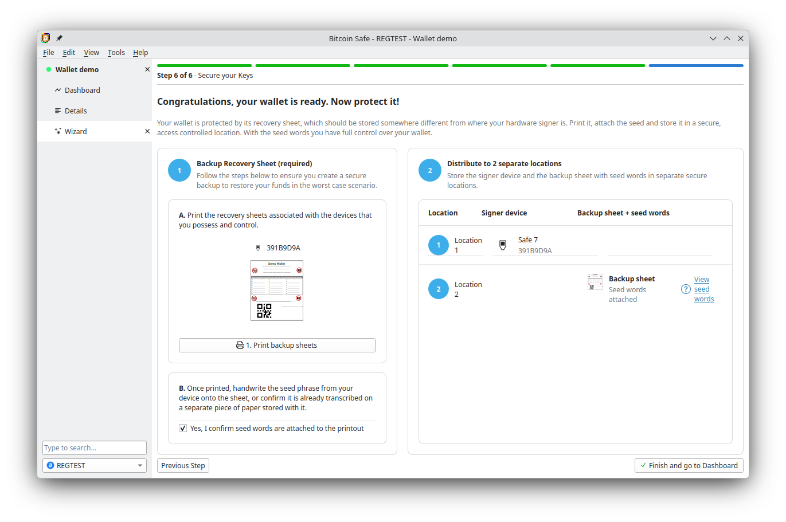
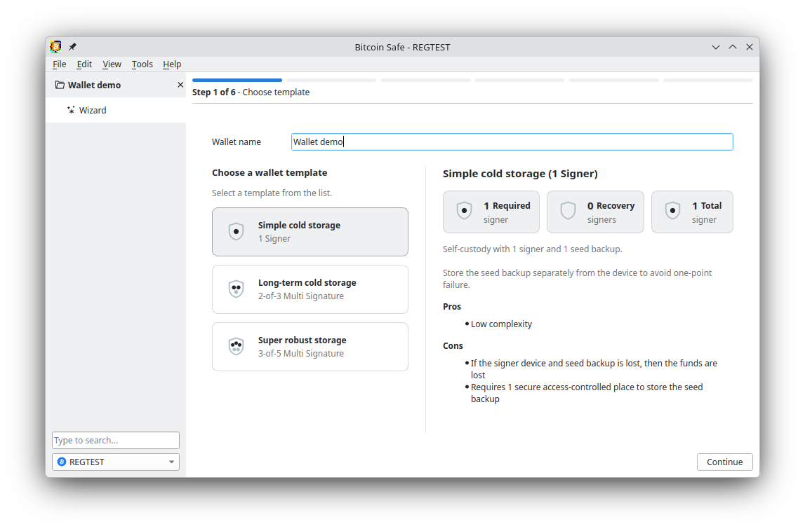

---
aliases:
  - "/news/bitcoin-safe-2-0-0/"
title: "Bitcoin Safe 2.0.0"
date: "2026-06-09"
draft: false
description: "Release notes for Bitcoin Safe 2.0.0, featuring a rebuilt setup wizard,  Compact Block Filters by default, and broader hardware wallet support."
images: ["setup-wizard-template.png"]
previewimage: "setup-wizard-template.png"
---

{ .img-fluid .mb-5 style="max-width: 700px;" }

- [📥 Download Bitcoin Safe]()

## A friendlier path into self-custody

The first-run experience has been rebuilt from the ground up. Bitcoin Safe still aims at serious self-custody, including hardware-backed multisig, but 2.0 makes the journey much clearer for new users. The new setup wizard explains what is happening, where you are in the flow, and what each signer needs from you before you move on.

Highlights from the redesign:

- A new welcome screen that helps first-time users pick the right starting point
- A clearer step-by-step progress flow during wallet creation
- Device-specific signing screens with focused instructions and contextual help
- Better recovery PDFs with device names and icons so backups stay unambiguous

{ .img-fluid .mb-5 style="max-width: 700px;" }

## Compact Block Filters are now the default

[Compact Block Filters]() are now the default sync method for new wallets in Bitcoin Safe 2.0. Instead of asking an Electrum server which addresses belong to you, Bitcoin Safe can now scan the chain privately by downloading compact filters from random Bitcoin Core peers and checking them locally.

That means:

- Better sync privacy for new wallets out of the box
- No dependence on a third-party Electrum indexer just to get started
- Fast ongoing sync after the first wallet scan
- [Instant notifications of relayed transactions]()
- Electrum still remains available for users who prefer it

{ .img-fluid .mb-5 style="max-width: 700px;" }
 
   
 
## A clearer signing flow for every device

The redesign in [PR #639](https://github.com/andreasgriffin/bitcoin-safe/pull/639) also improves the signing flow after wallet creation. Instead of one generic screen for every signer, Bitcoin Safe now centers the actions around the specific device you are using.

- QR, USB, Bluetooth, file export/import, and Sync & Chat actions are shown directly on the active signer card
- Remaining signers, already signed devices, and the next required action are easier to distinguish at a glance
- Mixed-device multisig flows are easier to reason about because signer identity stays visible throughout the PSBT

{ .img-fluid .mb-5 style="max-width: 700px;" }

## And much much more

- [Trezor Safe 7]() is now supported
- [Blockstream Jade]() USB, QR and *Bluetooth* are supported
- See the [entire list of supported devices]()
- Stronger [binary security and reproducibility](), including easier automated checking of reproducible builds
- **2x** faster animated QR codes for quicker scanning
- [Countless](github.com/andreasgriffin/bitcoin-safe/compare/1.8.1...2.0.0) interface improvements and small bug fixes

  
## Existing strengths that are still here

The 2.0 release is not a reset. Under the new onboarding and signing flow, Bitcoin Safe still carries the features that made it useful day to day: collaborative multisig, PDF backups, searchable wallet history, money-flow visualizations, label sync, and more.



  

## Thank you

This release stands on a lot of work from contributors, testers, and [supporters across the project]():

- [@design-rrr](https://github.com/design-rrr) ([nostr](https://nostr.com/npub12lg6yexfh0gsk8aupv5cr5fnj46l0kxg6lp6rz0zw6kwx603lmsshmac9c),  [X](https://x.com/deSign__r)) for the wizard redesign, plugin UI work, dark mode, and relentless UX polish
- [@rustaceanrob](https://github.com/rustaceanrob) for the Compact Block Filter client that now powers default sync for new wallets
- The [Bitcoin Dev Kit team](https://github.com/bitcoindevkit/) for the libraries at the core of Bitcoin Safe
- The [ndk team](npub1drvpzev3syqt0kjrls50050uzf25gehpz9vgdw08hvex7e0vgfeq0eseet) for the libraries that power nostr functionality
- Everyone in the Bitcoin Safe community who tested release candidates, reported bugs, translated pages, sent sats, and kept pushing the project forward
- [Translators]() including 

